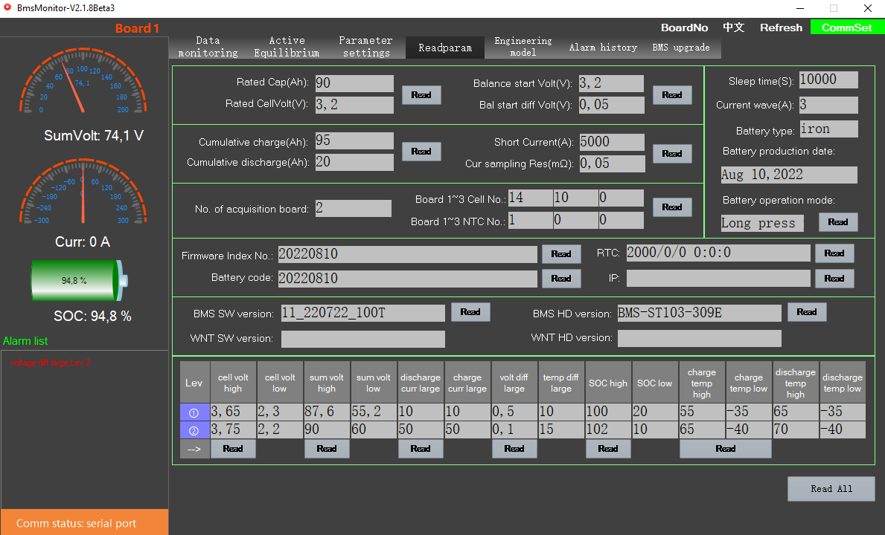
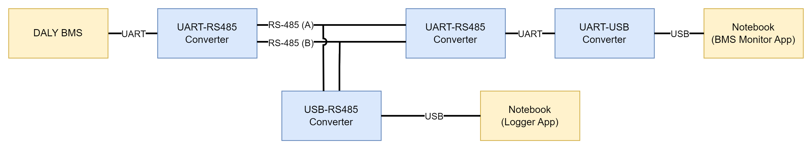

## Расширенный протокол взаимодействия по UART с BMS ф. Daly / Daly UART Communication Protocol (Extended)

**UPDATES ARE EXPECTED**

В данном репозитории приводится описание расширенного протокола взаимодействия по UART с BMS (Battery Management System) ф. Daly,
полученного с помощью реверс-инжиниринга. Акцент при исследовании протокола сделан на чтение параметров

### Особенности исследования протокола / Protocol Research Details

Фирма Daly предоставляет [спецификацию стандартного протокола](.docs/daly_uart_protocol_v1.2%20(1).pdf),
с помощью которого можно прочитать основные параметры аккумуляторной батареи.
Также фирма поставляет официальное приложение BMS Monitor для персонального компьютера,
имеющее расширенные возможности по работе с BMS (чтение и установка параметров как аккумуляторной батареи, так и самой платы).
Стоит отметить, что данное приложение совместимо только с определенным модельным рядом, по найденной информации от RT16T и выше.
Способ взаимодействия с приложением определяется возможностями конкретной платы, однако в общем случае используется интерфейс UART

Для анализа передаваемых сообщений между приложением и платой реализована схема, представленная ниже.
Интерфейс UART типа точка-точка заменен на общую шину RS-485, к которой с помощью преобразователя подключается ноутбук.
Для записи сообщений можно использовать любое приложение для работы с последовательным портом.
Исходными данными для анализа послужили значения параметров из BMS Monitor и структура сообщений из спецификации стандартного протокола

Конфигурация оборудования:
* Smart BMS LiFePO4 24S 500A, модель R32ND
* Преобразователь UART-RS485 (x2)
* Преобразователь USB-RS485
* Преобразователь USB-UART CP2102
* BMS Monitor v2.1.8 (beta 3)
* Windows 10

### Список сообщений / List of Messages

Детальная информация по полученным сообщениям представлена в приложенном [документе](.docs/daly_uart_protocol_extended.pdf)

| №   | Data ID | Type   (R - Read, W - Write) | Description                                                                               |
| :-: | :-----: | :-----------------------------: | :---------------------------------------------------------------------------------------- |
| 1   | 0x50    | R                               | Rated capacity and Rated cell voltage                                                     |
| 2   | 0x51    | R                               | Number of acquisition boards, Number of cell for each board, Number of NTC for each board |
| 3   | 0x52    | R                               | Cumulative charge and Cumulative discharge                                                |
| 4   | 0x53    | R                               | Battery type, Battery mode, Production date, Current wave, Sleep time                     |
| 5   | 0x54    | R                               | Firmware index                                                                            |
| 6   | 0x57    | R                               | Battery code                                                                              |
| 7   | 0x59    | R                               | Cell voltage error level                                                                  |
| 8   | 0x5A    | R                               | Sum voltage error level                                                                   |
| 9   | 0x5B    | R                               | Charge and discharge current high error level                                             |
| 10  | 0x5C    | R                               | Charge and discharge temperature error level                                              |
| 11  | 0x5D    | R                               | SOC error level                                                                           |
| 12  | 0x5E    | R                               | Voltage and temperature difference error level                                            |
| 13  | 0x5F    | R                               | Balance start voltage and voltage difference                                              |
| 14  | 0x60    | R                               | Short current and Sampling resistance                                                     |
| 15  | 0x62    | R                               | Software version                                                                          |
| 16  | 0x63    | R                               | Hardware version                                                                          |
| 17  | 0x65    | R                               | Address                                                                                   |
| 18  | 0x66    | R                               | Heat temperature on and Fan temperature on                                                |
| 19  | 0xD9    | W                               | Discharge control                                                                         |
| 20  | 0xDA    | W                               | Charge control                                                                            |
